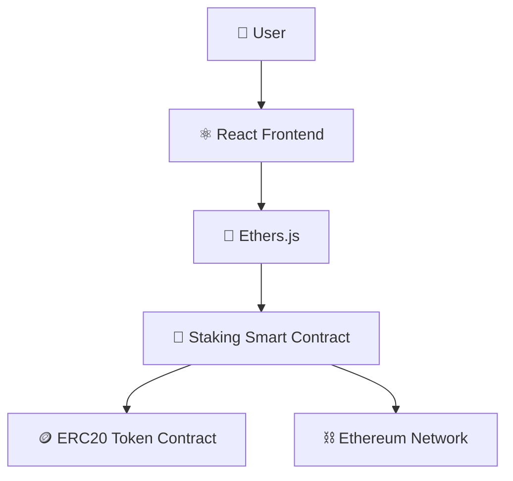

<div align="center">

# 💎 Staking DApp

**A DeFi application for locking ERC20 tokens and earning on-chain staking rewards**


</div>

---

## 📑 Table of Contents

- [Overview](#-overview)
- [Features](#-features)
- [Tech Stack](#-tech-stack)
- [Architecture](#-architecture)
- [Smart Contract Functions](#-smart-contract-functions)
- [Getting Started](#-getting-started)
- [Learning Outcomes](#-learning-outcomes)
- [Future Improvements](#-future-improvements)
- [Author](#-author)

---

## 📖 Overview

**Staking DApp** is a decentralized finance (DeFi) application that allows users to lock ERC20 tokens in a smart contract and earn staking rewards. The project demonstrates one of the most widely used mechanisms in modern DeFi protocols.

The application enables token holders to participate in staking pools while earning rewards based on their staked balance — no intermediaries, no custodians.

---

## ✨ Features

| Feature | Description |
|---|---|
| 🔒 Stake ERC20 Tokens | Lock tokens into the staking contract |
| 🔓 Unstake Tokens | Withdraw staked tokens at any time |
| 🎁 Claim Rewards | Collect earned rewards based on stake duration |
| 👛 Wallet Integration | Connect via MetaMask or any injected wallet |
| 🔗 Smart Contract Interaction | All actions handled on-chain |
| 📊 Real-Time Staking Information | Live balance and reward data from the contract |

---

## 🛠 Tech Stack

| Layer | Technologies |
|---|---|
| **Frontend** | React, JavaScript, Ethers.js |
| **Blockchain** | Solidity, Hardhat, ERC20 Token Standard |

---

## 🏗 Architecture



---

## 📜 Smart Contract Functions

| Function | Type | Description |
|---|---|---|
| `stake()` | Write | Locks ERC20 tokens into the staking pool |
| `unstake()` | Write | Withdraws staked tokens back to the user |
| `claimRewards()` | Write | Transfers accumulated rewards to the user |

```solidity
function stake(uint256 _amount) public {
    staked[msg.sender] += _amount;
    token.transferFrom(msg.sender, address(this), _amount);
}

function unstake(uint256 _amount) public {
    staked[msg.sender] -= _amount;
    token.transfer(msg.sender, _amount);
}

function claimRewards() public {
    uint256 reward = calculateReward(msg.sender);
    rewardToken.transfer(msg.sender, reward);
}
```

---

## 🚀 Getting Started

### Prerequisites
- Node.js (v16+)
- MetaMask browser extension
- Hardhat

### Installation

```bash
# Clone the repository
git clone https://github.com/Jeevan9898/staking-dapp.git
cd staking-dapp

# Install dependencies
npm install

# Compile the smart contracts
npx hardhat compile

# Start a local blockchain
npx hardhat node

# Deploy the contracts
npx hardhat run scripts/deploy.js --network localhost

# Start the frontend
cd frontend
npm install
npm start
```

---

## 🎓 Learning Outcomes

- DeFi Fundamentals
- Staking Mechanisms
- Smart Contract Development
- Reward Distribution Logic
- Contract-to-Contract Interaction

---

## 🔮 Future Improvements

- [ ] Multiple Staking Pools
- [ ] Dynamic APY
- [ ] Governance Integration
- [ ] Analytics Dashboard

---

## 👤 Author

**Jeevan Yadav**

[](https://jeevan-yadav.vercel.app/)
[](https://github.com/Jeevan9898)
